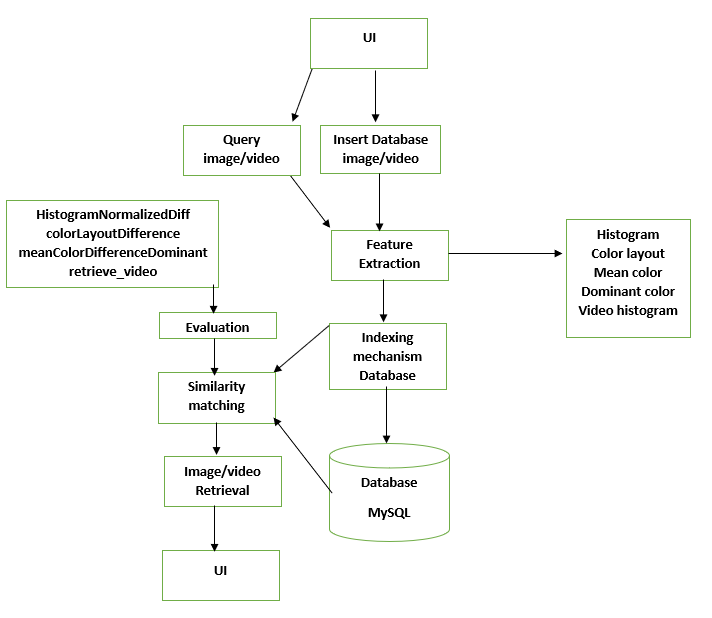
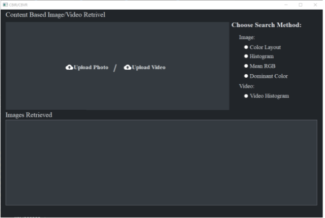

# Brief Description

This project is about Content-Based Multimedia Retrieval systems. Multimedia retrieval systems in this project are divided into two parts:
* content-based image retrieval systems 
* content-based video retrieval systems.

The purpose of this project is to provide three algorithms to retrieve images from database, and one algorithm to retrieve videos from database. 
The user should select whether he wants to retrieve an image or a video. If he wants to retrieve an image, he should select an algorithm of the three algorithms used to retrieve the image. This project supports on algorithm for video retrieval, so the user Is forced to use it. The input then, should be an image or a video. After that the user should click Search in the Gui and the program should work to retrieve the image or the video from the database based on the algorithm the user selected earlier. 
Images and videos are stored in the database in terms of their features and a link to the actual image or video itself. When the user enters an image or video the algorithm runs to convert this image into its features so that it can be comparable with the features in the database. 
The output of the program should be a collection of images or a collection of videos, based on the user input, that will best match the entered image or video depending on the selected algorithm. 

The project uses three algorithms for image retrieval:
* Color histogram
* Mean color
* Color layout 

It uses one algorithm for video retrieval: Histogram feature extraction. 

# Modules

* UI module
* Evaluation module
* Feature extractor module
* DB module
* CBIR module

# System Architecture 

   

# User Guide:

  1. choose a query image or video
  2. choose the desired algorithm for retrieval
  3.  get your output results
